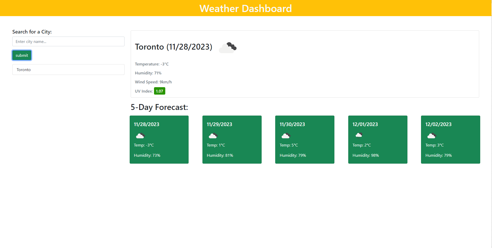

# WeatherDashboard
## Description
- The main objective of this challenge was to create a weather dashboard application for a travelling user.
- In addition to the above, we were tasked with displaying not only a current weather card, but a 5-day forecast as well.
- One of the biggest challenges was being able to use the correct api calls to ensure that the 5-day forecast was accurate.
- I learned that breaking down the syntax of an api URL allows me to pinpoint where or what needs to be changed. Also, learning to properly call an api was instrumental in the success of this project.

## Installation:
- Clone the repository on github locally. After being successfully cloned, files are editable through VSC.

## Usage:
- https://pnguyen412.github.io/WeatherDashboard/
- https://github.com/pnguyen412/WeatherDashboard
  
 

   
## Collaborators:
- https://github.com/arkenwald

## License:
MIT License

Copyright (c) 2023, Philip Nguyen

Permission is hereby granted, free of charge, to any person obtaining a copy
of this software and associated documentation files (the "Software"), to deal
in the Software without restriction, including without limitation the rights
to use, copy, modify, merge, publish, distribute, sublicense, and/or sell
copies of the Software, and to permit persons to whom the Software is
furnished to do so, subject to the following conditions:

The above copyright notice and this permission notice shall be included in all
copies or substantial portions of the Software.

THE SOFTWARE IS PROVIDED "AS IS", WITHOUT WARRANTY OF ANY KIND, EXPRESS OR
IMPLIED, INCLUDING BUT NOT LIMITED TO THE WARRANTIES OF MERCHANTABILITY,
FITNESS FOR A PARTICULAR PURPOSE AND NONINFRINGEMENT. IN NO EVENT SHALL THE
AUTHORS OR COPYRIGHT HOLDERS BE LIABLE FOR ANY CLAIM, DAMAGES OR OTHER
LIABILITY, WHETHER IN AN ACTION OF CONTRACT, TORT OR OTHERWISE, ARISING FROM,
OUT OF OR IN CONNECTION WITH THE SOFTWARE OR THE USE OR OTHER DEALINGS IN THE
SOFTWARE.
